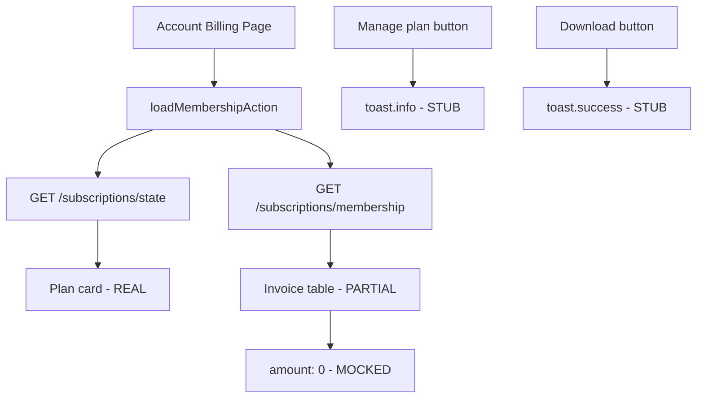

# Billing Frontend Audit — NovaSafe Clients

**Audit date:** 2026-06-06  
**Scope:** `novasafe-app-v2`, `novasafe-auth-v2`, `novasafe-extension`, `novasafe-landing-v2`

---

## Executive Summary

| App | Billing maturity | Data source |
|-----|------------------|-------------|
| `novasafe-auth-v2` | **Production purchase flow** | Real RC SDK + real API |
| `novasafe-app-v2` | **Display only, partial stubs** | Real API for plan; mocked invoices/manage |
| `novasafe-extension` | **Not implemented** | No API calls |
| `novasafe-landing-v2` | **Marketing only** | Links to signup/pro |

---

## 1. novasafe-auth-v2

### Pages & routes

| Route | Component | Purpose |
|-------|-----------|---------|
| `/signup/pro` | `signup.pro.tsx` | Pro signup with paywall stage machine |

### Paywall components

| File | Role | Data |
|------|------|------|
| `components/auth/paywall/PaywallCard.tsx` | Main purchase UI | Real RC SDK |
| `components/auth/paywall/PlanCard.tsx` | Plan display | From RC offerings |
| `components/auth/paywall/PlanToggle.tsx` | Monthly/yearly toggle | Local state |
| `components/auth/paywall/ProSuccessCard.tsx` | Post-purchase success | Real subscription snapshot |
| `components/auth/paywall/ProFailureCard.tsx` | Failure + retry | Real error states |

### Billing library

```
src/lib/billing/
  client.ts           — RC Web SDK wrapper (lazy-loaded)
  server-actions.ts   — confirmProEntitlementAction, loadSubscriptionStateAction
  types.ts            — PaywallPlan, SubscriptionSnapshot
src/config/billing.config.ts
```

### API endpoints used

| Endpoint | Called from | Purpose |
|----------|-------------|---------|
| `POST /api/v1/subscriptions/sync` | `confirmProEntitlementAction` | Post-purchase entitlement confirm |
| `GET /api/v1/subscriptions/state` | `loadSubscriptionStateAction` | Skip paywall if already Pro |

**Not called from auth-v2:** `GET /offerings`, `GET /membership` (offerings come from RC SDK directly).

### Purchase flow

```
SignupCard (create free account + session)
  → PaywallCard
    → billingClient.loadOfferings(user.id)
    → billingClient.purchase({ appUserId: user.id, customerEmail, cycle })
      → RC SDK → Paddle modal
    → confirmProEntitlementAction (up to 4 retries, 800ms backoff)
      → POST /subscriptions/sync
```

### Configuration gate

```typescript
// billing.config.ts
enabled: env.REVENUECAT_PUBLIC_API_KEY_WEB.length > 0
```

Empty key → `ConfigurationMissing` UI → user continues as Free.

### Status: ✅ Works (when env configured)

---

## 2. novasafe-app-v2

### Pages & routes

| Route | File | Purpose |
|-------|------|---------|
| `/_app/account/billing` | `_app.account.billing.tsx` | Billing & invoices |
| `/_app/account/profile` | `_app.account.profile.tsx` | Pro/Free badge |
| `/_app/account` | `_app.account.tsx` | Account shell/nav |

### Missing pages (not found)

| Expected page | Status |
|---------------|--------|
| Dedicated pricing page | ❌ (lives on landing) |
| Upgrade modal | ❌ |
| Subscription management page | ❌ (billing page is partial) |
| Checkout page | ❌ (delegated to auth-v2 signup/pro) |

### Billing page analysis (`_app.account.billing.tsx`)

| UI element | Data source | Status |
|------------|-------------|--------|
| Current plan (Free/Pro) | `loadMembershipAction` → real API | ✅ Real |
| Subscription status | `state.subscriptionStatus` | ✅ Real |
| Renewal date | `state.renewsAt` | ✅ Real |
| Provider label | `state.subscriptionProvider` | ✅ Real (`revenuecat`) |
| **Manage plan button** | `toast.info("Manage billing from...")` | ❌ **Stub** |
| Invoice list | `membership.recentActivity` (webhook events) | ⚠️ Partial |
| Invoice amounts | Hardcoded `amount: 0` | ❌ **Mocked** |
| **Download invoice** | `toast.success("Invoice downloaded")` | ❌ **Mocked** |

### API layer (`src/lib/api/endpoints/subscriptions.ts`)

| Method | Endpoint | Used by |
|--------|----------|---------|
| `GET` | `/api/v1/subscriptions/state` | `loadMembershipAction`, settings |
| `POST` | `/api/v1/subscriptions/sync` | Not called from app-v2 |
| `GET` | `/api/v1/subscriptions/membership` | `loadMembershipAction` |

Comment in file:

> *"The app does not initiate purchases (that lives in novasafe-auth-v2's Pro signup flow)."*

### Account server actions (`src/lib/account/server-actions.ts`)

- `loadMembershipAction` — parallel fetch state + membership
- `loadAccountSettingsAction` — includes subscription state for profile
- `loadActivityAction` — dashboard activity

### Entitlement usage in UI

**None.** The `SubscriptionEntitlements` interface is defined but **no component reads entitlement flags** to gate features.

### Upgrade CTA

**Missing everywhere:**
- No "Upgrade to Pro" in Sidebar, UserMenu, VaultPage
- No link to `/signup/pro` or external checkout
- Free users who signed up via `/signup` have no in-app upgrade path

### Status: ⚠️ Partially implemented (read-only + stubs)

---

## 3. novasafe-extension

### Subscription state

```typescript
// extensionState.ts
user.subscription: { plan, status, renewsAt }
```

- Persisted to `chrome.storage` via `stateManager`
- Default: `{ plan: null, status: "none" }`
- **`ExtensionSnapshot` (popup UI) excludes subscription** — popup never sees plan data

### API integration

- No calls to `/api/v1/subscriptions/*` found in extension code
- No subscription fetch on login/unlock
- No upgrade UI in popup

### Pro feature gates

| Feature | Gate |
|---------|------|
| Autofill | None |
| Password history UI | None (backend may 403 delete) |
| Custom fields | None |
| Device pairing limit | Backend returns `NOVASAFE_DEVICE_LIMIT` (handled in auth-v2 pairing, not extension popup) |

### Status: ❌ Not implemented (types only)

---

## 4. novasafe-landing-v2

### Pricing page

| File | Route | Content |
|------|-------|---------|
| `src/pages/marketing/Pricing.tsx` | `/pricing` | Free + Pro plan cards |

### CTAs

| Button | Destination |
|--------|-------------|
| "Create free account" | `buildSignupUrl({ ref: "pricing_free" })` → auth signup |
| "Start with Pro" | `buildSignupProUrl({ ref: "pricing_pro" })` → auth `/signup/pro` |

### Billing integration

- No direct API calls
- No RC/Paddle SDK on landing
- Marketing copy references cancellation/refunds in legal pages

### Status: ✅ Marketing complete; no transactional billing

---

## 5. Endpoint Coverage vs User Request

| Requested endpoint | Exists? | Actual path |
|--------------------|---------|-------------|
| `GET /billing/status` | ❌ | `GET /api/v1/subscriptions/state` |
| `GET /billing/entitlements` | ❌ | Entitlements embedded in `/state` response |
| `GET /billing/plans` | ❌ | `GET /api/v1/subscriptions/offerings` (unused by app-v2) |
| `POST /billing/checkout` | ❌ | RC SDK purchase in auth-v2 (client-side) |
| `POST /billing/manage` | ❌ | No portal endpoint |

Legacy vault service has `/v/billing/*` (Razorpay) — separate system, not used by v2 apps.

---

## 6. Mock vs Real Summary

| Component | Real | Mocked/Stub |
|-----------|------|-------------|
| auth-v2 paywall purchase | ✅ | |
| auth-v2 entitlement confirm | ✅ | |
| app-v2 plan display | ✅ | |
| app-v2 manage plan | | ✅ toast stub |
| app-v2 invoice amounts | | ✅ hardcoded 0 |
| app-v2 invoice download | | ✅ toast stub |
| app-v2 feature gates | | ✅ all features open |
| app-v2 upgrade CTA | | ✅ missing |
| extension subscription | | ✅ never loaded |
| landing pricing | ✅ links only | |

---

## 7. Data Flow Diagram (app-v2)



---

## 8. Gaps for Web App Billing

1. No in-app upgrade path for existing free users
2. No Paddle/RC customer portal integration
3. No real invoice/receipt display
4. No entitlement-driven UI (features visible to all, API may reject)
5. Extension completely unaware of subscription tier
6. No shared subscription context hook/store in app-v2
