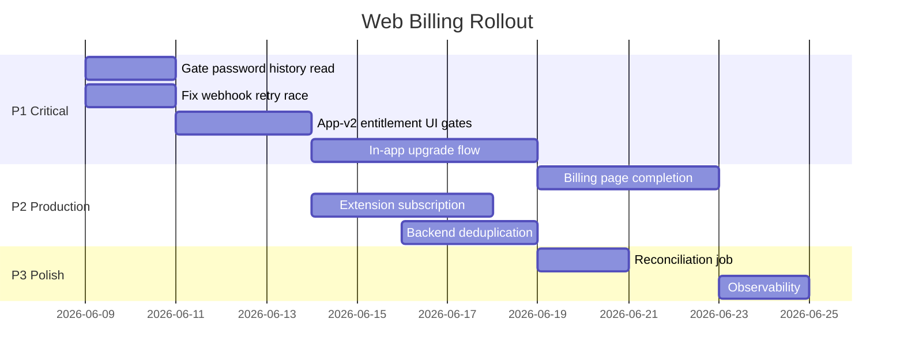

# Final Implementation Plan — Web Billing & Subscriptions

**Based on:** RevenueCat, Paddle, Frontend, and Security audits (2026-06-06)  
**Prerequisite:** Audit complete — no code written during audit phase.

This plan assumes **RevenueCat remains the billing orchestrator** and Paddle stays integrated via RC Web SDK (not direct Paddle webhooks).

---

## Current State Summary

| Area | Status |
|------|--------|
| RC webhook + backend sync | ✅ Production-ready (mobile) |
| Web purchase (auth-v2 signup/pro) | ✅ Implemented |
| Cross-platform identity (`user.id`) | ✅ Correct |
| App-v2 billing page | ⚠️ Partial (stubs) |
| App-v2 upgrade path | ❌ Missing |
| Extension subscription | ❌ Missing |
| Paddle direct integration | ❌ Not needed if RC path kept |
| Password history read gate | ❌ **Security gap** |
| Frontend entitlement UI | ❌ Missing |

---

## Priority 1 — Critical (before marketing web Pro broadly)

### 1.1 Gate password history READ on backend

**Problem:** `GET /api/v1/vault/items/:id` returns decrypted `password_versions` without checking `canUsePasswordHistory`.

**Work:**
- In `getItemById` (or controller), call `assertEntitlement(userId, 'canUsePasswordHistory')`
- If not entitled: omit `password_versions` or return masked metadata only (dates, no passwords)
- Apply same rule to `pullSync` item payloads if versions are included

**Files:** `services/core/src/modules/vault/services/vault-items.service.ts`, `vault.controller.ts`, mirror in `mobile_vault` if still deployed.

**Acceptance:** Free user `GET item?revealSensitive=true` returns no password plaintext in history array.

---

### 1.2 Fix webhook failure + retry race

**Problem:** Failed webhook marked `processing`/`failed`; RC retry returns duplicate 200 without re-sync.

**Work:**
- On duplicate claim, check existing event `status`
- If `failed` or stale `processing` (> N minutes), allow reprocessing
- Or: return 500 on failure **before** claiming (claim only after successful RC sync)

**Files:** `revenueCatWebhookProcessor.ts`, `subscriptionRepository.ts`

**Acceptance:** Simulated RC API failure → retry → subscription state updates.

---

### 1.3 Frontend entitlement gates (app-v2)

**Problem:** Pro UI visible to free users; poor UX and security perception.

**Work:**
- Load `subscription.state.entitlements` in vault layout (already available via account actions)
- Gate `PasswordHistorySection` on `canUsePasswordHistory` — show upgrade CTA when false
- Gate future CSV export UI on `canUseCSVImportExport`
- Show device limit messaging where relevant

**Files:** `novasafe-app-v2/src/components/vault/VaultPage.tsx`, new `useSubscription` hook or zustand slice.

**Acceptance:** Free user sees upgrade prompt instead of password history; Pro user sees full section.

---

### 1.4 In-app upgrade path (app-v2)

**Problem:** Only `/signup/pro` supports purchase; existing free users cannot upgrade.

**Work:**
- Add "Upgrade to Pro" CTA on billing page, account profile, and/or vault (when feature gated)
- Options:
  - **A)** Redirect to auth-v2 hosted paywall route (requires session + user id)
  - **B)** Embed RC Web SDK in app-v2 (duplicate billing client from auth-v2)
  - **C)** Open auth-v2 `/signup/pro` in upgrade mode for authenticated users (new route e.g. `/upgrade`)

**Recommendation:** Option C — extend auth-v2 with `/upgrade` for logged-in users; app-v2 links there.

**Acceptance:** Logged-in free user can complete Paddle checkout and return to app with Pro active.

---

## Priority 2 — Required production work

### 2.1 Complete billing page (app-v2)

| Task | Detail |
|------|--------|
| Replace "Manage plan" stub | RC SDK `manageSubscriptions()` or Paddle customer portal URL from RC |
| Real invoice data | Map `mobilePurchaseHistory` via new API endpoint or extend `/membership` |
| Invoice download | Link to Paddle receipt URL or RC transaction detail |

**New backend endpoint (if needed):** `GET /api/v1/subscriptions/purchases` reading `mobilePurchaseHistory`.

---

### 2.2 Subscription context in app-v2

- Shared hook: `useSubscription()` wrapping `GET /state` with 60s stale time
- Expose `tier`, `isPro`, `entitlements`, `limits` to all account + vault routes
- Invalidate on focus after returning from upgrade flow

---

### 2.3 Extension subscription awareness

- Fetch `GET /api/v1/subscriptions/state` after vault unlock
- Include `plan` / `isPro` in `ExtensionSnapshot`
- Show plan badge in popup header
- Gate password history delete UI on entitlement (read already backend-gated after 1.1)
- Optional: upgrade link to web app billing/upgrade

**Files:** `novasafe-extension/src/extension/state/stateManager.ts`, `store.tsx`, `HomeScreen.tsx`

---

### 2.4 Consolidate duplicate backend implementations

- Pick **core** as canonical subscription module
- Deprecate or thin-proxy `mobile_vault` subscription code to core
- Single webhook processor path on `mobile-api.novasafe.io`

---

### 2.5 Legacy Razorpay bridge decision

**Decision required:** Are legacy `vault` service Razorpay subscribers migrated to RC?

| Option | Effort |
|--------|--------|
| Migrate users to RC Pro | High |
| Read both systems in `getSubscriptionState` | Medium |
| Deprecate Razorpay, RC-only going forward | Low (if no active Razorpay subs) |

Document decision before web launch in India if Razorpay still has paying users.

---

### 2.6 Environment & deployment checklist

- [ ] `REVENUECAT_WEBHOOK_SECRET` set on mobile-api
- [ ] `REVENUECAT_SECRET_API_KEY` set on core + mobile_vault
- [ ] `VITE_REVENUECAT_PUBLIC_API_KEY_WEB` in auth-v2 production build
- [ ] RC dashboard: Paddle connected, offerings published, `pro` entitlement linked
- [ ] Webhook URL: `https://mobile-api.novasafe.io/mobile/subscriptions/webhook/revenuecat`
- [ ] RC Web Billing allowed domains include auth + app origins

---

## Priority 3 — Nice-to-have improvements

### 3.1 `mobileEntitlements` collection

Either populate from RC sync or remove unused schema to reduce confusion.

### 3.2 `trialEndsAt` population

Map from RC `period_type` / trial fields if trials are offered.

### 3.3 Scheduled reconciliation job

`vault_scheduler` cron: re-sync subscribers with `subscriptionStatus` active but `expiresAt` in the past.

### 3.4 `canUseAdvancedSecurity` enforcement

Define which routes use this flag; add guards or remove unused entitlement.

### 3.5 Custom fields entitlement (product decision)

If custom fields should be Pro-only, add backend gate + frontend CTA. Currently free for all.

### 3.6 Landing page pricing sync

Ensure pricing amounts match RC offering prices (currently static marketing copy).

### 3.7 Webhook observability

Dashboard for `mobileSubscriptionEvents` failed/ignored counts; alert on spike.

### 3.8 Entitlement refresh on critical paths

Use `assertEntitlementWithRefresh` (not just cache) for password history delete and cloud sync.

---

## Suggested Implementation Order

---

## Endpoint Roadmap (optional aliases)

User-requested paths do not exist today. Recommended mapping:

| Requested | Implement as |
|-----------|--------------|
| `GET /billing/status` | Already `GET /api/v1/subscriptions/state` |
| `GET /billing/entitlements` | Sub-object of `/state` (no separate endpoint needed) |
| `GET /billing/plans` | `GET /api/v1/subscriptions/offerings` (wire in app-v2) |
| `POST /billing/checkout` | Client-side RC SDK (not server POST) |
| `POST /billing/manage` | RC `manageSubscriptions()` or portal URL endpoint |

---

## Success Criteria for Web Pro Launch

1. Free user cannot read password history plaintext (API + UI)
2. Existing free user can upgrade without re-signup
3. Pro purchase on web reflects in app-v2 within 30s (sync + webhook)
4. Android Pro user sees Pro in web app without re-purchase
5. Billing page shows real plan status and working manage-subscription link
6. Webhook failures self-heal on retry
7. No duplicate subscription code paths in production deployment

---

## Audit Documents

| Document | Path |
|----------|------|
| RevenueCat Audit | `docs/billing-audit/REVENUECAT_AUDIT.md` |
| Paddle Audit | `docs/billing-audit/PADDLE_AUDIT.md` |
| Frontend Audit | `docs/billing-audit/BILLING_FRONTEND_AUDIT.md` |
| Security Audit | `docs/billing-audit/SUBSCRIPTION_SECURITY_AUDIT.md` |
| This plan | `docs/billing-audit/FINAL_IMPLEMENTATION_PLAN.md` |
