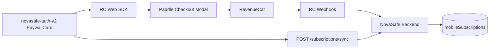
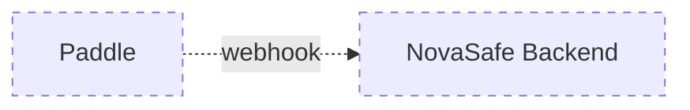
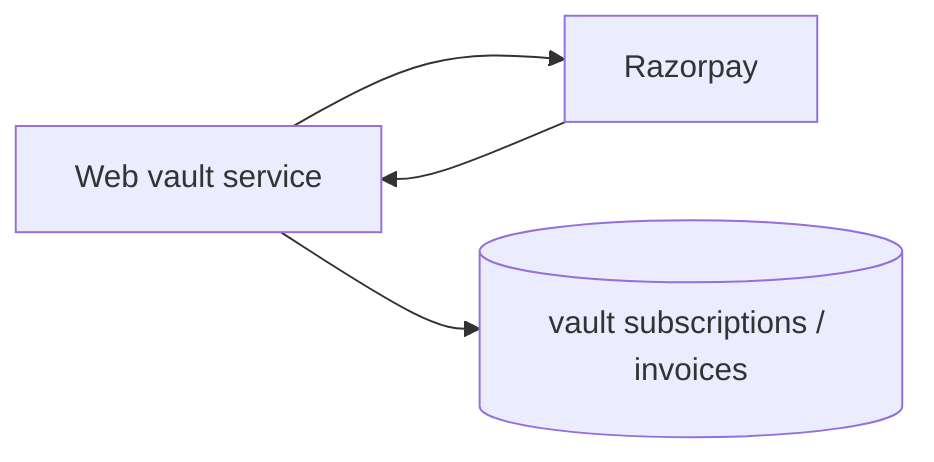

# Paddle Audit — NovaSafe

**Audit date:** 2026-06-06  
**Scope:** Full workspace billing integration  
**Method:** Read-only code inspection.

---

## Executive Summary

**Paddle is not directly integrated into the NovaSafe backend.** There is no Paddle webhook handler, no Paddle API client, and no `paddleProvider.ts` implementation.

**Paddle is integrated indirectly for web subscriptions** through RevenueCat's Web Billing SDK. The purchase path is:

```
User (novasafe-auth-v2)
  → RevenueCat Web SDK (@revenuecat/purchases-js)
    → Paddle checkout modal (hosted by RC)
      → RevenueCat records transaction
        → RevenueCat webhook
          → NovaSafe backend (/mobile/subscriptions/webhook/revenuecat)
            → mobileSubscriptions cache update
```

**Verdict:** Paddle web subscriptions **are architecturally supported** via RevenueCat. Direct Paddle → Backend integration **does not exist**.

---

## 1. Search Results

### Backend (`novasafe-backend`)

| File | Paddle reference | Status |
|------|------------------|--------|
| `services/vault/src/config/payment.config.ts` | `paddle: { enabled: false }` | Placeholder only |
| `services/vault/src/services/payment/types.ts` | `'paddle'` in union type | Type stub |
| `services/vault/src/services/payment/paymentRouter.ts` | Commented `// providers.set('paddle', ...)` | Not registered |
| `services/vault/src/models/PaymentOrder.ts` | `'paddle'` in provider union | Type stub |

**No files found for:**
- `paddleProvider.ts`
- Paddle webhook routes
- `PADDLE_*` environment variables
- Paddle transaction/subscription models

### Frontend (`v2/novasafe-auth-v2`)

| File | Role |
|------|------|
| `src/lib/billing/client.ts` | RC Web SDK; `purchases.purchase()` opens Paddle modal |
| `src/components/auth/paywall/PaywallCard.tsx` | Orchestrates purchase + entitlement confirm |
| `src/config/billing.config.ts` | `REVENUECAT_PUBLIC_API_KEY_WEB` gate |

Comment in `client.ts` (line 125–126):

> *"The RC SDK opens a modal Paddle checkout and resolves once the user either pays, cancels, or hits an error."*

### Other repos

- `novasafe-app-v2` — No Paddle references
- `novasafe-extension` — No Paddle references
- `novasafe-landing-v2` — Pricing page links to `/signup/pro`; no Paddle SDK

---

## 2. Integration Status Matrix

| Integration path | Status |
|------------------|--------|
| Paddle → Backend (direct webhook) | ❌ Not started |
| Paddle → Backend (direct API) | ❌ Not started |
| Paddle → RevenueCat → Webhook → Backend | ✅ **Active path for web** |
| Paddle customer portal / manage subscription | ❌ Not implemented |
| Paddle invoice download | ❌ Not implemented |
| iOS/Android store purchases | Via RC native SDK (App Store / Play), not Paddle |

---

## 3. Architecture Diagram

### Actual (Web)



### Not implemented



### Legacy parallel system (unrelated to Paddle)



The legacy `vault` Razorpay system does **not** share state with RevenueCat/Paddle.

---

## 4. RevenueCat ↔ Paddle Linkage

### What RevenueCat handles

- Paddle product mapping (configured in RC dashboard)
- Checkout UI (Paddle modal via RC SDK)
- Subscription lifecycle events
- Entitlement grants (`pro` entitlement)
- Webhook emission to NovaSafe backend

### What NovaSafe handles

- Webhook receipt and auth (`REVENUECAT_WEBHOOK_SECRET`)
- Subscriber state sync from RC REST API
- Entitlement flags in `SubscriptionState`
- Lifecycle emails (purchase, renewal, cancellation, etc.)

### What is NOT handled

- Paddle-specific webhook verification
- Paddle customer ID storage
- Paddle billing portal URL generation
- Paddle invoice PDF retrieval
- Tax/VAT handling (delegated to Paddle/RC)

---

## 5. Configuration Requirements (Web)

For web Paddle purchases to work end-to-end:

| Config | Where | Required |
|--------|-------|----------|
| `VITE_REVENUECAT_PUBLIC_API_KEY_WEB` | auth-v2 | ✅ Enables paywall |
| RC Web Billing + Paddle connected | RC Dashboard | ✅ |
| Products in RC offerings | RC Dashboard | ✅ |
| `pro` entitlement linked to products | RC Dashboard | ✅ |
| `REVENUECAT_WEBHOOK_SECRET` | Backend | ✅ |
| `REVENUECAT_SECRET_API_KEY` | Backend | ✅ |
| Webhook URL pointing to mobile-api | RC Dashboard | ✅ (confirmed in use) |

If `VITE_REVENUECAT_PUBLIC_API_KEY_WEB` is empty, auth-v2 shows "Pro signup is paused" and skips billing.

---

## 6. Missing Pieces for Production Web Billing

| # | Missing piece | Impact |
|---|---------------|--------|
| 1 | Paddle Customer Portal link in app-v2 billing page | Users cannot self-manage/cancel |
| 2 | Real invoice data (amount, PDF) | Billing page shows $0 mock amounts |
| 3 | In-app upgrade for existing free users (app-v2) | Only `/signup/pro` path exists |
| 4 | Paddle webhook direct handler | Not needed if RC remains source of truth |
| 5 | Unify legacy Razorpay vault billing with RC | Two parallel subscription systems |
| 6 | Extension subscription awareness | Extension cannot reflect Pro status |

---

## 7. Does Current Architecture Support Paddle Web Subscriptions?

**Yes**, via RevenueCat as the billing orchestrator:

- ✅ Web purchase flow exists (`novasafe-auth-v2`)
- ✅ Webhook updates backend state
- ✅ Cross-platform entitlement (same `user.id` as RC App User ID)
- ✅ Backend entitlement enforcement (partial — see security audit)

**No** for direct Paddle integration:

- ❌ No Paddle API keys in backend
- ❌ No Paddle-specific endpoints
- ❌ No subscription management portal

---

## 8. Recommendation (audit only — no implementation)

Keep RevenueCat as the single billing orchestrator for web + mobile. Do **not** add direct Paddle webhooks unless RC is removed from the path. Production work should focus on:

1. Paddle Customer Portal via RC SDK or RC dashboard links
2. Completing app-v2 billing UI (real data, manage subscription)
3. In-app upgrade flow for existing users
4. Deprecating or bridging legacy Razorpay `vault` billing
