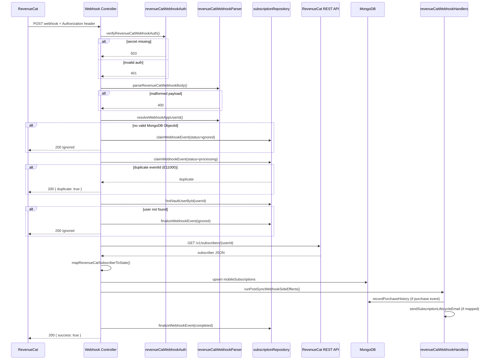

# RevenueCat Audit — NovaSafe Backend & Clients

**Audit date:** 2026-06-06  
**Scope:** `novasafe-backend`, `novasafe-app-v2`, `novasafe-auth-v2`, `novasafe-extension`, `Novasafe-capacitor-app` (mobile reference)  
**Method:** Read-only code inspection — no changes made.

---

## Executive Summary

RevenueCat is **fully implemented on the backend** for mobile and web subscription lifecycle. The webhook at `https://mobile-api.novasafe.io/mobile/subscriptions/webhook/revenuecat` is production-ready with auth, idempotency, RC API sync, and email side effects.

**Source of truth:** RevenueCat REST API → cached in MongoDB `mobileSubscriptions` per user.

**Customer identity:** MongoDB `user._id` (24-char ObjectId string) is used as the RevenueCat App User ID across iOS, Android, and Web.

**Gaps:** Duplicate implementation in `mobile_vault` + `core`; webhook retry race condition; `mobileEntitlements` collection is a stub; legacy `vault` Razorpay billing is a separate silo.

---

## 1. File Inventory

### Backend — `services/core` (primary API)

| Category | Path |
|----------|------|
| Module entry | `src/modules/subscriptions/index.ts` |
| Routes | `src/modules/subscriptions/routes/subscription.routes.ts` |
| Controllers | `src/modules/subscriptions/controllers/subscription.controller.ts` |
| Config | `src/modules/subscriptions/config/subscription.config.ts` |
| Types | `src/modules/subscriptions/revenuecat/types.ts` |
| Webhook auth | `src/modules/subscriptions/revenuecat/revenueCatWebhookAuth.ts` |
| Webhook parser | `src/modules/subscriptions/revenuecat/revenueCatWebhookParser.ts` |
| Webhook processor | `src/modules/subscriptions/revenuecat/revenueCatWebhookProcessor.ts` |
| Webhook side effects | `src/modules/subscriptions/revenuecat/revenueCatWebhookHandlers.ts` |
| RC subscriber sync | `src/modules/subscriptions/revenuecat/revenueCatSubscriberSync.ts` |
| State mapper | `src/modules/subscriptions/revenuecat/subscriptionStateMapper.ts` |
| Entitlement resolver | `src/modules/subscriptions/revenuecat/entitlementResolver.ts` |
| Repository | `src/modules/subscriptions/revenuecat/subscriptionRepository.ts` |
| Logger | `src/modules/subscriptions/revenuecat/subscriptionLogger.ts` |
| RC REST client | `src/modules/subscriptions/services/revenue-cat.service.ts` |
| Subscription service | `src/modules/subscriptions/services/subscription.service.ts` |
| Lifecycle email | `src/modules/subscriptions/services/subscription-email.service.ts` |
| Entitlement middleware | `src/modules/vault/middleware/entitlement.middleware.ts` |
| Device limit (multi-device) | `src/modules/auth/services/device-trust.service.ts` |
| Mongoose schemas | `src/database/schemas/subscriptions/*` |

### Backend — `services/mobile_vault` (duplicate mirror)

Near-identical copies under `src/subscription/` and `src/services/revenueCatService.ts`, `subscriptionService.ts`. Same webhook path registered at `/mobile/subscriptions`.

### Backend — `services/vault` (legacy, separate)

Razorpay/PayU web billing. RevenueCat listed in `payment.config.ts` as `enabled: false`. **Not connected** to the RC subscription system.

### Clients

| Repo | Files | Status |
|------|-------|--------|
| `Novasafe-capacitor-app` | `src/subscription/**`, `revenueCatClient.ts` | **Production** — native RC SDK |
| `novasafe-auth-v2` | `src/lib/billing/**`, `src/components/auth/paywall/**` | **Production** — RC Web SDK + Paddle checkout |
| `novasafe-app-v2` | `src/lib/api/endpoints/subscriptions.ts` | **Read-only** — state/membership display |
| `novasafe-extension` | `extensionState.ts` subscription field | **Stub** — never populated from API |

---

## 2. Webhook Architecture

### Endpoint

```
POST /mobile/subscriptions/webhook/revenuecat
POST /api/v1/subscriptions/webhook/revenuecat   (same handler, core service)
```

Registered in `registerSubscriptionsModule()`:

```typescript
app.use(`${apiPrefix}/subscriptions`, routes);  // /api/v1/subscriptions
app.use('/mobile/subscriptions', routes);
```

### Sequence Diagram



### Supported Event Types

All 14 types are declared in `REVENUECAT_WEBHOOK_EVENT_TYPES`:

| Event | Purchase history | Lifecycle email |
|-------|------------------|-----------------|
| `INITIAL_PURCHASE` | ✅ | `purchase_successful` |
| `RENEWAL` | ✅ | `subscription_renewed` |
| `CANCELLATION` | — | `subscription_cancelled` |
| `EXPIRATION` | — | `subscription_expired` |
| `BILLING_ISSUE` | — | `payment_failed` |
| `UNCANCELLATION` | ✅ | `subscription_renewed` |
| `PRODUCT_CHANGE` | ✅ | `subscription_renewed` |
| `SUBSCRIPTION_PAUSED` | — | `subscription_cancelled` |
| `TRANSFER` | ✅ | `restore_successful` |
| `NON_RENEWING_PURCHASE` | ✅ | — |
| `SUBSCRIPTION_EXTENDED` | ✅ | — |
| `TEMPORARY_ENTITLEMENT_GRANT` | — | — (RC sync only) |
| `INVOICE_ISSUANCE` | — | — (RC sync only) |
| `TEST` | — | — (RC sync only) |

**Processing model:** Every accepted event triggers a full RC subscriber re-fetch and state persist, regardless of event type. Side effects (purchase history, email) are event-specific.

---

## 3. Error Handling & Idempotency

| Concern | Implementation | Status |
|---------|----------------|--------|
| Auth validation | `crypto.timingSafeEqual` on `REVENUECAT_WEBHOOK_SECRET` | ✅ Correct for RC bearer model |
| Signature (HMAC) | Not used — RC uses shared secret in Authorization header | ✅ By design |
| Duplicate events | Unique index on `mobileSubscriptionEvents.eventId`; duplicate → 200 | ✅ |
| Purchase idempotency | Unique index on `mobilePurchaseHistory.transactionId` | ✅ |
| Retries | No internal retry queue | ❌ Missing |
| Dead letter | Failed events marked `status: failed` in DB | ⚠️ Partial |
| **Retry race** | On 500, RC retries; retry hits duplicate claim and returns 200 without re-processing | ❌ **Critical gap** |

### Webhook failure scenario

1. Event claimed (`status: processing`)
2. RC API call fails → catch → `finalizeWebhookEvent(failed)` → HTTP 500
3. RevenueCat retries with same `eventId`
4. `claimWebhookEvent` returns `duplicate` → 200, **no re-sync**

---

## 4. Customer Identity Model

### RevenueCat App User ID

**Value:** MongoDB `vaultUsers._id` as string (24-char hex ObjectId).

### Resolution order (webhook)

```typescript
// revenueCatWebhookParser.ts
candidates = [app_user_id, ...aliases[], original_app_user_id]
// First candidate passing ObjectId.isValid() wins
```

### Client configuration

| Platform | Code | App User ID |
|----------|------|-------------|
| iOS / Android | `Novasafe-capacitor-app/revenueCatClient.ts` | `user.id` from auth |
| Web signup | `novasafe-auth-v2/PaywallCard.tsx` | `user.id` from signup session |
| Backend sync | `revenueCatSubscriberSync.ts` | `String(user._id)` |

### Mapping diagram

```
NovaSafe User (vaultUsers._id)
        ↕ 1:1 string identity
RevenueCat Subscriber (app_user_id)
        ↕ webhook + REST sync
mobileSubscriptions.state (MongoDB cache)
```

**Not used:** email, anonymousId, separate RC customer ID field in DB.

### Multi-platform entitlement

Because all platforms use the same `user.id` as RC App User ID:

- User who purchases on **Android** → RC subscriber `userId` → webhook updates `mobileSubscriptions`
- Same user logs into **Web** → `GET /api/v1/subscriptions/state` reads same MongoDB document → **same Pro entitlement**

✅ Cross-platform identity is **architecturally correct** when clients configure RC with backend user ID.

---

## 5. Entitlement Model

### Tiers

| Tier | `tier` field | `isPro` | `isActive` |
|------|--------------|---------|------------|
| Free | `"free"` | `false` | varies |
| Pro | `"pro"` | `true` | `true` when entitlement active |

No `enterprise` tier in backend RC module (extension types mention it but backend only has `free | pro`).

### Entitlement keys (`EntitlementKey`)

| Key | Free | Pro |
|-----|------|-----|
| `canUseCloudSync` | false | true |
| `canUseCSVImportExport` | false | true |
| `canUseUnlimitedPasswords` | false | true |
| `canUseUnlimitedNotes` | false | true |
| `canUsePasswordHistory` | false | true |
| `canUseAdvancedSecurity` | false | true |
| `canUseMultiDevice` | false | true |

### Free plan limits (env-configurable)

```
FREE_PLAN_MAX_PASSWORDS = 15
FREE_PLAN_MAX_SECURE_NOTES = 5
FREE_PLAN_MAX_DEVICES = 1
```

### Storage

| Collection | Purpose | Populated? |
|------------|---------|------------|
| `mobileSubscriptions` | Cached `SubscriptionState` per user | ✅ Primary cache |
| `mobileSubscriptionEvents` | Webhook event log | ✅ |
| `mobilePurchaseHistory` | Transaction records | ✅ |
| `mobileEntitlements` | Per-entitlement documents | ❌ Schema only, never written |

### Source of truth

```
RevenueCat (authoritative)
    ↓ GET /v1/subscribers/{userId}  (on webhook, /sync, forceRefresh)
mobileSubscriptions.state (cache)
    ↓ read by API + entitlement guards
Client apps
```

`GET /state` returns cache by default; `?forceRefresh=true` or `POST /sync` hits RC live.

### Entitlement resolution (`entitlementResolver.ts`)

1. Preferred ID: `REVENUECAT_ENTITLEMENT_PRO` (default `"pro"`)
2. Fallbacks: `["pro", "novasafe_pro"]`
3. If no active entitlement → check `subscriber.subscriptions` store records (grace period via `grace_period_expires_date`)

---

## 6. Subscription API Endpoints (Core)

| Method | Path | Auth | Purpose |
|--------|------|------|---------|
| `GET` | `/api/v1/subscriptions/state` | JWT | Read subscription state |
| `POST` | `/api/v1/subscriptions/sync` | JWT | Force RC refresh |
| `GET` | `/api/v1/subscriptions/offerings` | JWT | RC offerings (server-side) |
| `GET` | `/api/v1/subscriptions/membership` | JWT | State + recent webhook events |
| `GET` | `/api/v1/subscriptions/debug` | JWT + debug key | Full debug snapshot |
| `POST` | `/api/v1/subscriptions/webhook/revenuecat` | RC secret | Webhook ingress |

Mirror path: `/mobile/subscriptions/*` (identical routes).

---

## 7. Platform Support

| Platform | Purchase flow | State read | Webhook benefit |
|----------|---------------|------------|-----------------|
| iOS | Native RC SDK | `/subscriptions/state` | ✅ |
| Android | Native RC SDK | `/subscriptions/state` | ✅ |
| Web | RC Web SDK → Paddle modal (`novasafe-auth-v2`) | `/subscriptions/state` | ✅ |
| Extension | None | Not loaded | N/A |
| App-v2 | None (display only) | `/subscriptions/state`, `/membership` | ✅ (if purchased elsewhere) |

---

## 8. Environment Variables

```
REVENUECAT_WEBHOOK_SECRET      # Webhook Authorization validation
REVENUECAT_SECRET_API_KEY      # REST API (server-side)
REVENUECAT_ENTITLEMENT_PRO     # Default: "pro"
REVENUECAT_DEFAULT_OFFERING_ID
REVENUECAT_PROJECT_ID
REVENUECAT_API_BASE_URL
FREE_PLAN_MAX_PASSWORDS / MAX_SECURE_NOTES / MAX_DEVICES
SUBSCRIPTION_EMAIL_FROM
```

Web client (auth-v2):

```
VITE_REVENUECAT_PUBLIC_API_KEY_WEB   # RC Web SDK public key
```

---

## 9. Known Issues

| # | Issue | Severity |
|---|-------|----------|
| 1 | Duplicate `mobile_vault` + `core` implementations | High |
| 2 | Webhook retry swallowed by idempotency on failure | High |
| 3 | Two billing silos: RC (mobile/web) vs Razorpay (`vault` service) | High |
| 4 | `mobileEntitlements` collection unused | Medium |
| 5 | `trialEndsAt` never populated in mapper | Medium |
| 6 | No scheduled subscription expiry/reconciliation job | Medium |
| 7 | `TEST` events run full pipeline including user lookup | Low |

---

## 10. Verdict

| Area | Status |
|------|--------|
| Webhook endpoint | ✅ Works — production-ready for mobile |
| Event processing | ✅ All types accepted; 8 have email/purchase side effects |
| Customer identity | ✅ Unified MongoDB ObjectId across platforms |
| Entitlement cache | ✅ Works via RC sync |
| Web Paddle via RC | ✅ Supported through RC Web SDK (not direct Paddle webhook) |
| Extension | ❌ Not integrated |
| App-v2 purchase | ❌ No in-app upgrade path (signup/pro only) |
