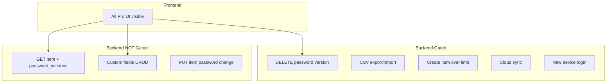

# Subscription Security Audit — NovaSafe

**Audit date:** 2026-06-06  
**Scope:** Backend enforcement + frontend bypass analysis

---

## Executive Summary

**Backend enforcement exists but is incomplete.** Several Pro features are gated server-side, but **password history read access is not gated**, creating a bypass for free users who use the web app or extension.

**Frontend enforcement is effectively absent** — all Pro UI is visible regardless of plan. Users discover limits only via API 403 errors.

**Enforcement model:** Backend-only (partial) — not Frontend + Backend.

---

## 1. Backend Entitlement Enforcement

### Middleware: `requireEntitlement(entitlement)`

Location: `services/core/src/modules/vault/middleware/entitlement.middleware.ts`

Returns `403` with code `NOVASAFE_SUBSCRIPTION_REQUIRED` when entitlement is false.

### Routes with entitlement guards

| Route | Entitlement | File |
|-------|-------------|------|
| `POST /api/v1/vault/items/:id/password-versions/:versionId/expire` | `canUsePasswordHistory` | `vault.routes.ts` |
| `DELETE /api/v1/vault/items/:id/password-versions/:versionId` | `canUsePasswordHistory` | `vault.routes.ts` |
| `POST /api/v1/settings/export` | `canUseCSVImportExport` | `settings.routes.ts` |
| `POST /api/v1/settings/import/csv` | `canUseCSVImportExport` | `settings.routes.ts` |

### Inline enforcement (no middleware)

| Check | Location | Entitlement / limit |
|-------|----------|---------------------|
| `assertCanCreateVaultItem` | `vault.controller.ts` → `createVaultItem` | `canUseUnlimitedPasswords` / `maxPasswords` (15 free) |
| `assertEntitlementWithRefresh` | `settings.controller.ts` → cloud sync | `canUseCloudSync` |
| `evaluateDeviceLogin` | `device-trust.service.ts` | `canUseMultiDevice` / `maxDevices` (1 free) |

### Device limit response

```typescript
// auth.types.ts
code: 'NOVASAFE_DEVICE_LIMIT'
entitlement: 'canUseMultiDevice'
```

Surfaced in auth-v2 extension pairing UI when second browser profile is blocked.

---

## 2. Ungated / Bypassable Endpoints

### Critical: Password history READ is ungated

```typescript
// vault-items.service.ts — getItemById()
const passwordVersions = await getPasswordVersions(userId, item._id);
// Returns decrypted passwords for ALL versions — no entitlement check
```

`GET /api/v1/vault/items/:id?revealSensitive=true` returns full `password_versions[]` with plaintext passwords **without checking `canUsePasswordHistory`**.

| Operation | Gated? |
|-----------|--------|
| Read password history (GET item) | ❌ **No** |
| Delete password version | ✅ Yes |
| Expire password version | ✅ Yes |

**Impact:** Free-tier web app users can view full password history via `getVaultItemAction({ revealSensitive: true })` implemented in app-v2 `VaultPage.tsx`.

### Custom fields — no entitlement gate

| Operation | Gated? |
|-----------|--------|
| Read custom fields | ❌ No |
| Create/update/delete custom fields | ❌ No |

Custom fields are available to all authenticated users.

### Vault item update (password change)

`PUT /api/v1/vault/items/:id` — no entitlement check. Password changes create new versions for all users (backend behavior, not Pro-gated).

### Vault sync pull

`GET /api/v1/vault/sync/pull` — returns items; password versions included in item detail paths without tier check.

### Settings export/import

Gated on POST only. No pre-flight GET that leaks export data without gate.

---

## 3. Frontend Enforcement

### novasafe-app-v2

| Feature | UI shown to free users? | API gated? |
|---------|-------------------------|------------|
| Password history section | ✅ Always shown | Read: ❌ / Delete: ✅ |
| Custom fields | ✅ Always shown | ❌ |
| CSV export | No UI found | ✅ (if UI added) |
| Cloud sync toggle | Unknown / settings | ✅ |
| Multi-device login | N/A (auth layer) | ✅ |
| Item creation beyond limit | No UI warning | ✅ |

**No component checks `state.entitlements.*` before rendering Pro features.**

### novasafe-auth-v2

- Paywall only at signup — no ongoing enforcement
- Extension pairing shows device limit error (backend-driven)

### novasafe-extension

- Zero entitlement checks in popup UI
- All vault features accessible in UI regardless of plan

---

## 4. Pro-Only Features Inventory

| Feature | Backend gate | Frontend gate | Bypass risk |
|---------|--------------|---------------|-------------|
| Password history (view) | ❌ | ❌ | **High** |
| Password history (delete) | ✅ | ❌ | Low (403 on action) |
| Custom fields | ❌ | ❌ | None (free for all) |
| CSV import/export | ✅ | ❌ | Medium (no UI yet) |
| Cloud sync | ✅ | ❌ | Medium |
| Unlimited passwords | ✅ (create only) | ❌ | Low |
| Unlimited secure notes | ✅ (create only) | ❌ | Low |
| Multi-device | ✅ (login) | ❌ | Low (auth error) |
| Advanced security | Flag exists | ❌ | Unknown — no route found using this flag |

---

## 5. Source of Truth for Access Decisions

```
Client request
  → JWT auth (userId)
  → getSubscriptionStateForUser(userId)  // reads mobileSubscriptions cache
  → assertEntitlement / requireEntitlement / inline checks
  → allow or 403
```

**Cache staleness risk:** Most checks use cached state without RC refresh. Only `assertEntitlementWithRefresh` (cloud sync) forces live RC fetch.

**Expired Pro user window:** If webhook delayed and cache stale, user may retain Pro access until next sync. Mitigated partially by `/sync` after purchase.

---

## 6. Authentication vs Authorization

| Layer | Status |
|-------|--------|
| Webhook auth (`REVENUECAT_WEBHOOK_SECRET`) | ✅ timingSafeEqual |
| JWT on subscription endpoints | ✅ |
| Debug endpoint | ✅ Requires `x-debug-key` |
| Entitlement on sensitive reads | ❌ Incomplete |

---

## 7. Vulnerabilities

| # | Vulnerability | Severity | Details |
|---|---------------|----------|---------|
| 1 | Free users can read password history via GET item | **High** | `getItemById` returns decrypted `password_versions` without entitlement check |
| 2 | No frontend entitlement gates | **Medium** | Poor UX; users hit 403 unexpectedly; features appear Pro-ready |
| 3 | Webhook failure + idempotency race | **High** | Failed events not reprocessed on RC retry (billing state) |
| 4 | Stale cache without refresh on most gates | **Medium** | Cancelled subscription may retain access briefly |
| 5 | Two billing systems (RC vs Razorpay) | **Medium** | Inconsistent entitlement sources for legacy web users |
| 6 | Extension has no subscription validation | **Low** | Backend still enforces on API calls; UI misleading |
| 7 | `canUseAdvancedSecurity` unused in routes | **Low** | Entitlement defined but no enforcement found |

---

## 8. Enforcement Diagram



---

## 9. Verdict

| Question | Answer |
|----------|--------|
| Pro access checked frontend only? | ❌ No — backend partial |
| Pro access checked backend only? | ⚠️ Partially |
| Frontend + Backend? | ❌ Not implemented |
| Backend validates before Pro features? | ⚠️ Some routes yes; password history read no |
| Safe to ship web password history to free users? | ❌ No — gate GET or strip versions for free tier |
