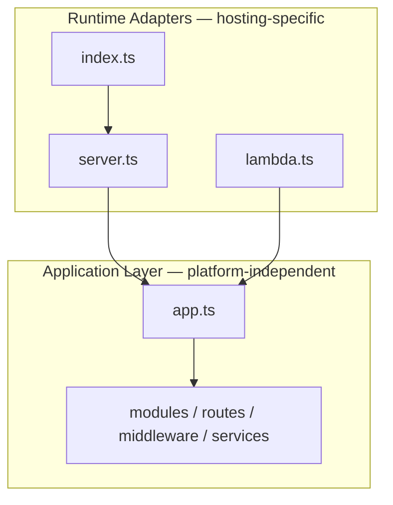

# Runtime Architecture

NovaSafe backend services are **runtime-agnostic**. Business logic, routing, middleware, and data access live in a shared **application layer**. **Runtime adapters** are thin files that only decide *how* the application is hosted.

This separation means the same codebase runs on local dev, Docker, VPS, EC2, ECS, or AWS Lambda without duplicating routes or controllers. Changing hosting platforms only requires swapping the runtime entrypoint.

---

## Layers



| Layer | File(s) | Responsibility |
|-------|---------|----------------|
| **Application** | `app.ts` | Create Express app, register middleware & routes, run `initializeApp()` (DB, seeds, catalogs) |
| **Server runtime** | `server.ts` | Read port/host env, call `initializeApp()`, `app.listen()`, graceful HTTP shutdown |
| **Process bootstrap** | `index.ts` | Load env, register signal handlers, invoke `startServer()` — Docker/VPS entrypoint |
| **Lambda runtime** | `lambda.ts` | Lazy `initializeApp()`, wrap Express with `@codegenie/serverless-express`, export handler |

**Rule:** `app.ts` never calls `app.listen()`. Only `server.ts` starts an HTTP server.

---

## Services

Both services follow the same layout:

| Service | Path | Default port |
|---------|------|--------------|
| Mobile API | `services/core/src/` | 3125 (dev) / 3124 (Docker prod) |
| Admin API | `services/admin-app/src/` | 3130 |

```
services/<service>/src/
├── app.ts       # Express application + initializeApp()
├── server.ts    # HTTP server (Docker, VPS, ECS, EC2, local)
├── lambda.ts    # AWS Lambda handler
├── index.ts     # Process entry (node dist/index.js)
└── modules/     # Routes, controllers, services (unchanged)
```

---

## Application layer (`app.ts`)

Owns everything that defines *what* the API is:

- Express instance creation
- Middleware (CORS, JSON, logging, request context)
- Route registration
- Error handlers
- **`initializeApp()`** — one-time async setup:
  - **Mobile API:** feature-flag catalog, MongoDB connection
  - **Admin API:** MongoDB connection, RBAC/feature-flag indexes & seeds, module registration

`initializeApp()` is idempotent (safe to call multiple times). Both `server.ts` and `lambda.ts` call it before serving traffic.

---

## Server runtime (`server.ts`)

For long-lived Node processes:

1. `await initializeApp()`
2. `app.listen(PORT, BIND_HOST)`
3. Log startup (port, database status)
4. `stopServer()` for graceful HTTP shutdown (used by Docker/VPS signal handlers)

**Entrypoints that use the server runtime:**

| Environment | Command / entry |
|-------------|-----------------|
| Local dev | `pnpm dev` → `tsx watch src/index.ts` |
| Production Docker | `CMD ["node", "dist/index.js"]` |
| VPS | Same Docker image via compose |
| ECS / EC2 | Same `index.js`; container orchestrator manages the process |

`index.ts` remains the Docker/VPS bootstrap — no deployment changes required.

---

## Lambda runtime (`lambda.ts`)

For AWS Lambda (and similar event-driven hosts):

1. `import './loadEnv'` — same env mechanism as other runtimes
2. On first invocation: `await initializeApp()`
3. Wrap the Express app with `@codegenie/serverless-express`
4. Export `handler` for API Gateway

No routing, middleware, or controller changes. Lambda is a **transport adapter** only.

```typescript
// Conceptual flow — see services/*/src/lambda.ts for implementation
const handler = serverlessExpress({ app });
```

MongoDB connection reuse and Lambda-specific DB tuning are **out of scope** for this layer and will be addressed in a follow-up PR.

---

## Why this separation exists

| Problem | How this architecture helps |
|---------|----------------------------|
| Lock-in to `app.listen()` | Application is a pure Express factory |
| Duplicated routes for Lambda | Single `app.ts` shared by all runtimes |
| Risky platform migrations | Swap `server.ts` ↔ `lambda.ts` at deploy time |
| Testing | Import `app` + `initializeApp` without binding a port |

**Future runtimes** (e.g. Bun, Cloud Run, another serverless provider) add a new adapter file that imports `app` and `initializeApp` — no business logic edits.

---

## Deployment matrix

| Platform | Runtime file | Build artifact |
|----------|--------------|----------------|
| Local | `index.ts` → `server.ts` | `pnpm dev` / `pnpm start` |
| Docker / VPS | `index.ts` → `server.ts` | `node dist/index.js` |
| ECS / EC2 | `index.ts` → `server.ts` | Same container image as Docker |
| AWS Lambda | `lambda.ts` | `dist/lambda.js` handler |

Environment variables, logging, and configuration are **unchanged** across runtimes — no Lambda-specific config abstractions.

---

## Adding a new runtime

1. Create `<platform>.ts` next to `server.ts` and `lambda.ts`
2. `import app, { initializeApp } from './app'`
3. Call `await initializeApp()` before handling requests
4. Adapt the platform's HTTP/event model to Express (or use an existing adapter)
5. Do **not** modify `modules/`, routes, or services

Examples already in repo:

- **Docker:** `index.ts` + `server.ts` (production today)
- **Lambda:** `lambda.ts` (ready for AWS deploy pipeline)

---

## Related docs

- `services/core/.env.example` — Mobile API configuration
- `services/admin-app/.env.example` — Admin API configuration
- `novasafe-deployment/opt/novasafe-deployment/` — VPS Docker compose templates
