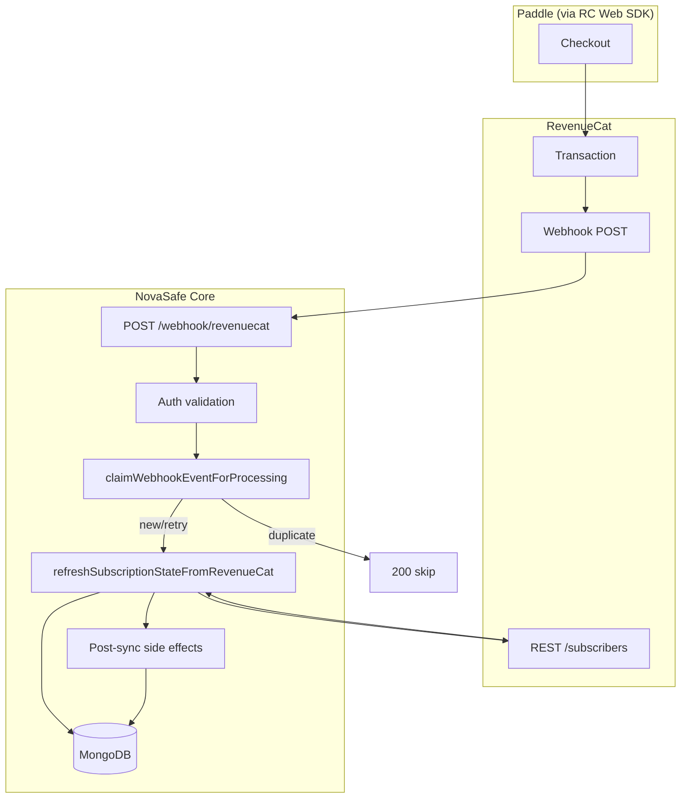

# Phase 2 — RevenueCat & Paddle Webhook Reliability Report

**Date:** 2026-06-06  
**Scope:** `services/core` backend only  
**Related:** [WEBHOOK_FLOW_AUDIT.md](./WEBHOOK_FLOW_AUDIT.md)

---

## Executive Summary

| Dimension | Before | After |
|-----------|--------|-------|
| Failed webhook retry | Stuck forever (`failed` + duplicate skip) | Reclaimed and reprocessed |
| Completed duplicate | Skipped (correct) | Skipped (unchanged) |
| Stale `processing` | Stuck indefinitely | Reclaimed after 5 min |
| Manual RC recovery | `POST /sync`, `forceRefresh` | Documented + logging enhanced |
| Structured webhook logs | Partial | Full lifecycle phases |
| Automated tests | 3 (vault only) | 16 (idempotency + lifecycle) |

---

## Files Audited

| File | Purpose |
|------|---------|
| `subscriptions/routes/subscription.routes.ts` | Route registration |
| `subscriptions/controllers/subscription.controller.ts` | HTTP handlers |
| `subscriptions/services/subscription.service.ts` | State API, entitlements, sync |
| `subscriptions/services/revenue-cat.service.ts` | RC REST client |
| `subscriptions/revenuecat/revenueCatWebhookProcessor.ts` | Webhook orchestrator |
| `subscriptions/revenuecat/revenueCatWebhookAuth.ts` | Secret validation |
| `subscriptions/revenuecat/revenueCatWebhookParser.ts` | Payload parse |
| `subscriptions/revenuecat/revenueCatWebhookHandlers.ts` | Email + purchase history |
| `subscriptions/revenuecat/revenueCatSubscriberSync.ts` | RC sync + persist |
| `subscriptions/revenuecat/subscriptionRepository.ts` | Event claim, state persist |
| `subscriptions/revenuecat/subscriptionStateMapper.ts` | RC → state mapping |
| `subscriptions/revenuecat/entitlementResolver.ts` | Pro resolution |
| `subscriptions/revenuecat/subscriptionLogger.ts` | Structured logging |
| `subscriptions/config/subscription.config.ts` | Entitlement config |
| `vault/utils/password-version-access.ts` | Phase 1 entitlement gate |

**Note:** No top-level `billing/`, `webhooks/`, or `revenuecat/` modules — all subscription code is under `subscriptions/revenuecat/`.

---

## Files Modified

| File | Change |
|------|--------|
| `revenuecat/webhook-idempotency.ts` | **NEW** — pure claim decision logic |
| `revenuecat/subscriptionRepository.ts` | `claimWebhookEventForProcessing`, retry reclaim |
| `revenuecat/revenueCatWebhookProcessor.ts` | Retry-safe claims + phased logging |
| `revenuecat/revenueCatSubscriberSync.ts` | State-change detection logging |
| `revenuecat/webhook-idempotency.test.ts` | **NEW** — idempotency unit tests |
| `revenuecat/subscriptionStateMapper.test.ts` | **NEW** — lifecycle scenario tests |
| `package.json` | Test glob for all `*.test.ts` |
| `docs/subscriptions/WEBHOOK_FLOW_AUDIT.md` | **NEW** |
| `docs/subscriptions/PHASE2_WEBHOOK_RELIABILITY_REPORT.md` | **NEW** |

---

## Architecture Diagram



---

## Failure Modes Found

### 1. Failed event retry deadlock (CRITICAL — fixed)

| Step | Behavior (before) |
|------|-------------------|
| 1 | Event claimed → `processing` |
| 2 | RC sync / DB error → `failed`, HTTP 500 |
| 3 | RC retries same `eventId` |
| 4 | `insertOne` E11000 → `duplicate` |
| 5 | HTTP 200, **no reprocessing** |

**Impact:** Subscription state never updates; user stuck on wrong tier until manual sync.

**Reproduction:** Kill Mongo mid-webhook or force RC API timeout → observe `failed` event → retry returns 200 duplicate.

### 2. Stale `processing` claims (MEDIUM — fixed)

Worker crash after claim leaves event in `processing` forever. Same duplicate-skip path blocked retries.

**Fix:** Reclaim after `STALE_PROCESSING_MS` (5 minutes).

### 3. Concurrent duplicate delivery (LOW — unchanged, correct)

Two simultaneous deliveries: one wins insert, other gets duplicate or loses reclaim race → 200 skip. Correct — only one processor runs.

### 4. Purchase history double-insert (LOW — already safe)

`recordPurchaseHistory` catches E11000 on `transactionId` unique index.

### 5. Subscription state overwrite (LOW — by design)

State is upserted from live RC subscriber — idempotent, not append-only.

### 6. Expired status mapping nuance (LOW — documented)

When entitlement row is inactive and no resolved product, `subscriptionStatus` may be `inactive` rather than `expired`. Entitlements still correctly removed (`tier=free`). No user-facing impact on gating.

---

## Fixes Implemented

### Idempotency hardening

New `claimWebhookEventForProcessing()`:

| Prior status | Outcome |
|--------------|---------|
| (none) | `new` — insert `processing` |
| `completed` / `ignored` | `duplicate` — skip |
| `failed` | `retry` — atomic reclaim |
| `processing` (< 5 min) | `duplicate` — concurrent in-flight |
| `processing` (≥ 5 min stale) | `retry` — atomic reclaim |

Pure decision logic extracted to `resolveWebhookClaimOutcome()` for unit testing.

### Logging & observability

Webhook processor logs `phase` field:

- `validation` — auth pass/fail
- `received` — parsed event metadata (no PII)
- `claim` — new / retry / duplicate
- `processing` — sync start
- `complete` — success + tier/status
- `failure` — error + `willRetry: true`

Sync logs `stateChanged`, `previousTier`, `previousStatus` when subscription fingerprint changes.

### Recovery path (existing — documented)

| Mechanism | Endpoint / function |
|-----------|---------------------|
| User-initiated sync | `POST /api/v1/subscriptions/sync` |
| Force refresh | `GET /api/v1/subscriptions/state?forceRefresh=true` |
| Entitlement check fallback | `assertEntitlementWithRefresh()` |

No scheduled reconciliation job added (per requirements).

---

## Test Results

```
npm run build  ✅
npm run test   ✅ 16/16 passing
```

| Test suite | Cases |
|------------|-------|
| `webhook-idempotency.test.ts` | new, duplicate, failed→retry, stale processing, terminal statuses |
| `subscriptionStateMapper.test.ts` | purchase, renewal, cancel, expire, refund |
| `password-version-access.test.ts` | Phase 1 entitlement redaction (3) |

---

## Subscription State Scenarios Verified

| Scenario | Expected | Verified |
|----------|----------|----------|
| A: Purchase Pro | Active pro + entitlements | ✅ mapper test |
| B: Renewal | Stays active, renewal timestamp | ✅ mapper test |
| C: Cancel | Active until expiry, status cancelled | ✅ mapper test |
| D: Expire | Free tier, entitlements off | ✅ mapper test |
| E: Refund | Free tier when RC shows no entitlement | ✅ mapper test |
| Duplicate webhook | No double processing | ✅ idempotency tests |
| Failed + RC retry | Reclaim and reprocess | ✅ idempotency + implementation |

---

## Remaining Production Risks

1. **No background reconciliation** — missed webhooks rely on user hitting sync or entitlement refresh. Recommend Phase 3 scheduled stale-subscriber sweep.
2. **5-minute stale window** — crashed worker blocks retry for up to 5 min. Tunable via `STALE_PROCESSING_MS`.
3. **RC API outage during webhook** — retries help, but sustained outage may require manual sync at scale.
4. **Email side effects on retry** — lifecycle emails may re-send on retry of failed events that passed sync but failed post-effects. Low frequency; consider idempotent email keys in Phase 3.
5. **`inactive` vs `expired` status** — cosmetic; entitlements correct.

---

## Recommendations Before Phase 3

1. **Scheduled reconciliation job** — nightly `forceRefresh` for subscribers with recent purchase events or `billing_issue` status.
2. **Webhook metrics** — emit counters for `claimOutcome`, `phase`, `stateChanged` to Datadog/Prometheus.
3. **Dead-letter admin endpoint** — list `failed` events older than N hours for manual replay.
4. **Email idempotency** — dedupe on `(userId, eventId, template)`.
5. **Integration test** — in-memory Mongo mock for full `processRevenueCatWebhook` retry path.
6. **Billing UI** — only after webhook reliability proven in staging with RC test events.

---

## Reliability Assessment

**Before Phase 2:** Production-unsafe for transient failures. A single DB timeout or RC API blip could permanently strand subscription state until user manually synced.

**After Phase 2:** Retry-safe for RevenueCat's delivery model. Completed events remain idempotent; failed and stale events recover automatically on RC retry or after stale timeout.
