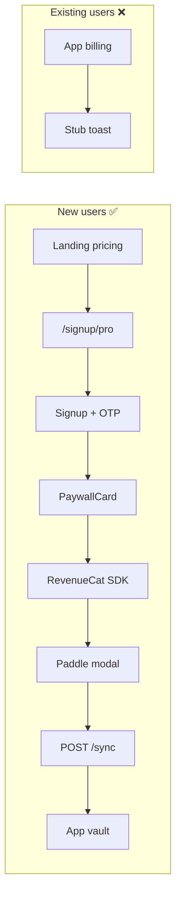
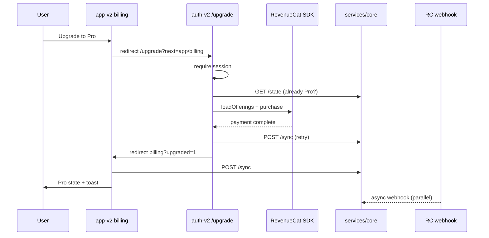

# Phase 3 — Existing User Upgrade Audit

**Date:** 2026-06-06  
**Scope:** `novasafe-app-v2`, `novasafe-auth-v2`, `services/core`

---

## Executive Summary

| Layer | Upgrade capability before Phase 3 |
|-------|-----------------------------------|
| **auth-v2** | Pro paywall exists at `/signup/pro` — **guest-only** (new signup) |
| **app-v2** | Read-only billing display — **no purchase path** |
| **core** | Full subscription API + webhooks — **ready** |

**Gap:** Existing authenticated free users had no route to reach the RevenueCat × Paddle checkout.

---

## Routes Audited

### novasafe-app-v2

| Route | File | Upgrade-related |
|-------|------|-----------------|
| `/account` | `_app.account.tsx` | Account shell |
| `/account/profile` | `_app.account.profile.tsx` | Free/Pro badge (read-only) |
| `/account/billing` | `_app.account.billing.tsx` | Plan card; stub "Manage plan" toast |
| `/account/*` | security, devices, activity, etc. | No upgrade CTAs |

**Missing:** `/upgrade`, in-app checkout, entitlement refresh after purchase.

### novasafe-auth-v2

| Route | File | Upgrade-related |
|-------|------|-----------------|
| `/signup/pro` | `signup.pro.tsx` | Full paywall — **rejects authenticated users** |
| `/signup` | `signup.index.tsx` | Free signup only |
| `/login` | `login.tsx` | Session gate |

**Reusable (not wired for existing users):**
- `PaywallCard.tsx` — RC SDK + Paddle purchase
- `billing/client.ts` — `loadOfferings()`, `purchase()`
- `billing/server-actions.ts` — `confirmProEntitlementAction`, `loadSubscriptionStateAction`

### novasafe-landing-v2 (reference only)

| Route | Behavior |
|-------|----------|
| Pricing page | `buildSignupProUrl()` → new-user Pro signup |

---

## Backend APIs Audited (`services/core`)

| Endpoint | Status | Used by upgrade? |
|----------|--------|------------------|
| `GET /api/v1/subscriptions/state` | ✅ Exists | Display + pre-check |
| `POST /api/v1/subscriptions/sync` | ✅ Exists | Post-purchase confirm |
| `GET /api/v1/subscriptions/membership` | ✅ Exists | Billing activity |
| `GET /api/v1/subscriptions/offerings` | ✅ Exists | Not used (SDK loads offerings) |
| `POST /webhook/revenuecat` | ✅ Hardened (Phase 2) | Async state update |

**Missing APIs:** None required for upgrade. Checkout is client-side RC Web SDK.

---

## Purchase Flow (pre-Phase 3)

---

## RevenueCat Integration

| Surface | RC SDK | Env vars |
|---------|--------|----------|
| auth-v2 | ✅ `@revenuecat/purchases-js` | `VITE_REVENUECAT_PUBLIC_API_KEY_WEB` |
| app-v2 | ❌ By design | None (Dockerfile excludes billing env) |

**App User ID:** MongoDB `user._id` string (matches webhook processor).

---

## Entitlement Gating (backend)

| Feature | Gate location | Status |
|---------|---------------|--------|
| Password history read | `password-version-access.ts` | ✅ Phase 1 |
| Password history delete | `vault.routes.ts` `requireEntitlement` | ✅ |
| CSV import/export | `settings.routes.ts` | ✅ |
| Device limits | `device-trust.service.ts` | ✅ |

App UI does not yet surface upgrade prompts on 403 — backend gates are enforced.

---

## Phase 3 Target Flow

---

## Design Constraints (honoured)

- No UI redesign
- No new navigation patterns
- Reuse `PaywallCard` + billing client from auth-v2
- No duplicate payment logic
- No backend refactor
- No Phase 4 features (portal, invoices, cancel UI)
