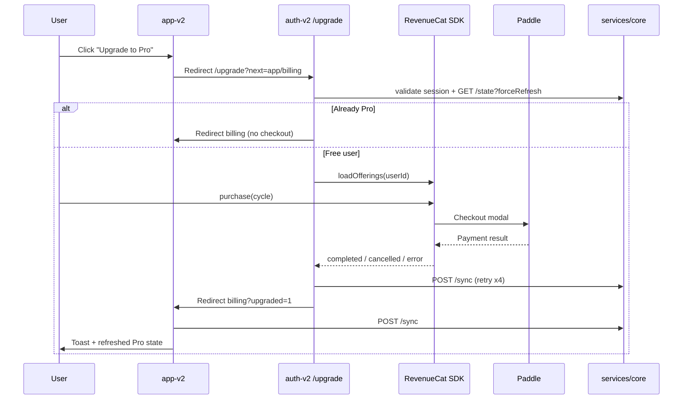

# Phase 3 — Existing User Upgrade Implementation Report

**Date:** 2026-06-06  
**Related:** [PHASE3_UPGRADE_AUDIT.md](./PHASE3_UPGRADE_AUDIT.md)

---

## Summary

Phase 3 adds a **Free → Pro upgrade path for existing authenticated users** by reusing the auth-v2 paywall (RevenueCat × Paddle) and wiring entry points in app-v2. No backend API changes were required.

---

## What Existed Already

| Component | Status |
|-----------|--------|
| RevenueCat Web SDK + Paddle checkout | auth-v2 `billing/client.ts` |
| Paywall UI (`PaywallCard`, plan toggle, success/failure cards) | auth-v2 |
| Post-purchase entitlement confirm (`confirmProEntitlementAction`) | auth-v2 → `POST /sync` |
| Subscription state APIs | core (`/state`, `/sync`, `/membership`) |
| Webhook hardening | Phase 2 |
| Backend entitlement gates (password history, CSV, devices) | core |
| App billing display (read-only) | app-v2 |
| New-user Pro signup | auth-v2 `/signup/pro` (guest-only) |

---

## What Was Added

| Change | Location |
|--------|----------|
| **`/upgrade` route** (authenticated paywall) | `novasafe-auth-v2/src/routes/upgrade.tsx` |
| **Auth guard** for upgrade | `auth-guard.ts`, `loadUpgradeSessionAction` |
| **`buildUpgradeUrl()`** URL helper | auth-v2 + app-v2 `routes.config.ts` |
| **`AUTH_PATH.Upgrade`** | auth-v2 + app-v2 `auth.config.ts` |
| **Billing "Upgrade to Pro" button** (free users) | app-v2 `_app.account.billing.tsx` |
| **Profile upgrade chip** (free users) | app-v2 `_app.account.profile.tsx` |
| **Post-return entitlement sync** | `syncSubscriptionAfterUpgradeAction` + billing `?upgraded=1` handler |
| **Paywall copy props** (`skipLabel`, `context`, `ctaLabel`) | Minimal optional props on existing cards |

### Backend changes

**None.** All required APIs already existed.

---

## Upgrade Flow Diagram



---

## Routes Audited

### app-v2

| Route | Phase 3 change |
|-------|----------------|
| `/account/billing` | Upgrade button + post-purchase sync |
| `/account/profile` | Upgrade chip for free users |
| Other account routes | Unchanged |

### auth-v2

| Route | Phase 3 change |
|-------|----------------|
| `/upgrade` | **NEW** — authenticated upgrade |
| `/signup/pro` | Unchanged (new users) |
| `/login` | Used as gate when session missing |

---

## APIs Used

| Endpoint | Role in upgrade |
|----------|-----------------|
| `GET /auth/validate-session` | Session gate |
| `GET /subscriptions/state?forceRefresh=true` | Skip paywall if already Pro |
| `POST /subscriptions/sync` | Post-purchase entitlement refresh |
| RC Web SDK `purchase()` | Paddle checkout (client-side) |
| `POST /webhook/revenuecat` | Async state update (parallel) |

---

## Test Scenarios

| Scenario | Expected behaviour | Implementation |
|----------|-------------------|----------------|
| **A: Free → Upgrade → Success** | Pro active immediately after return | `confirmProEntitlementAction` on auth + `syncSubscriptionAfterUpgradeAction` on app |
| **B: Cancel checkout** | Remain free, return to paywall ready state | `PaywallCard` handles `cancelled` → stays on paywall |
| **C: Payment failure** | Remain free | `ProFailureCard` with upgrade context → return to app |
| **D: Existing Pro user** | No duplicate checkout | `loadUpgradeSessionAction` redirects to app billing |
| **E: Delayed entitlement** | Graceful recovery | Retry confirm (4×) + app sync on `?upgraded=1` + friendly toast if sync fails |

### Build verification

```
novasafe-auth-v2  npm run build  ✅
novasafe-app-v2   npm run build  ✅
services/core     npm run build  ✅
services/core     npm run test   ✅ 16/16
```

Manual E2E testing with live Paddle sandbox recommended before production.

---

## Feature Gate Verification

| Feature | Backend gate | UI surfacing |
|---------|--------------|--------------|
| Password history (read) | `password-version-access.ts` | Redacts for free |
| Password history (delete) | `requireEntitlement` on route | API 403 |
| CSV import/export | settings routes | API 403 |
| Device limits | `device-trust.service.ts` | Pairing errors |
| Billing display | N/A | Shows Pro/Free after sync |

No backend bypasses introduced. App does not yet show upgrade prompts on generic 403 errors (future enhancement).

---

## Files Modified

### novasafe-auth-v2

- `src/routes/upgrade.tsx` (new)
- `src/lib/auth/auth-guard.ts` (new)
- `src/lib/auth/server-actions.ts`
- `src/config/auth.config.ts`
- `src/config/routes.config.ts`
- `src/config/index.ts`
- `src/components/auth/paywall/PaywallCard.tsx`
- `src/components/auth/paywall/ProFailureCard.tsx`
- `src/components/auth/paywall/ProSuccessCard.tsx`

### novasafe-app-v2

- `src/routes/_app.account.billing.tsx`
- `src/routes/_app.account.profile.tsx`
- `src/lib/account/server-actions.ts`
- `src/config/auth.config.ts`
- `src/config/routes.config.ts`
- `src/config/index.ts`

### services/core

- No code changes

### docs

- `docs/subscriptions/PHASE3_UPGRADE_AUDIT.md`
- `docs/subscriptions/PHASE3_UPGRADE_IMPLEMENTATION_REPORT.md`

---

## Known Limitations

1. **Cross-subdomain redirect** — Upgrade leaves app for auth subdomain; return uses `window.location` (required for shared session cookie domain).
2. **Pro user "Manage plan"** — Still a placeholder toast; subscription management deferred to Phase 4.
3. **Extension device-limit CTAs** — Still point to `/signup/pro` (new signup); not updated in this phase.
4. **Landing pricing** — Still targets new-user `/signup/pro`; appropriate for anonymous visitors.
5. **403 → upgrade prompt** — Vault/settings errors do not yet surface in-app upgrade CTAs.
6. **Invoice amounts** — Still show webhook events with `$0` placeholder amounts.

---

## Remaining for Phase 4

- Customer portal / cancel subscription
- Invoice download with real amounts
- Receipt management
- Subscription management UI ("Manage plan")
- Extension device-limit upgrade CTA for logged-in users
- In-app upgrade modal (optional — current cross-domain flow works)
- 403 entitlement errors → upgrade deep link in vault UI
