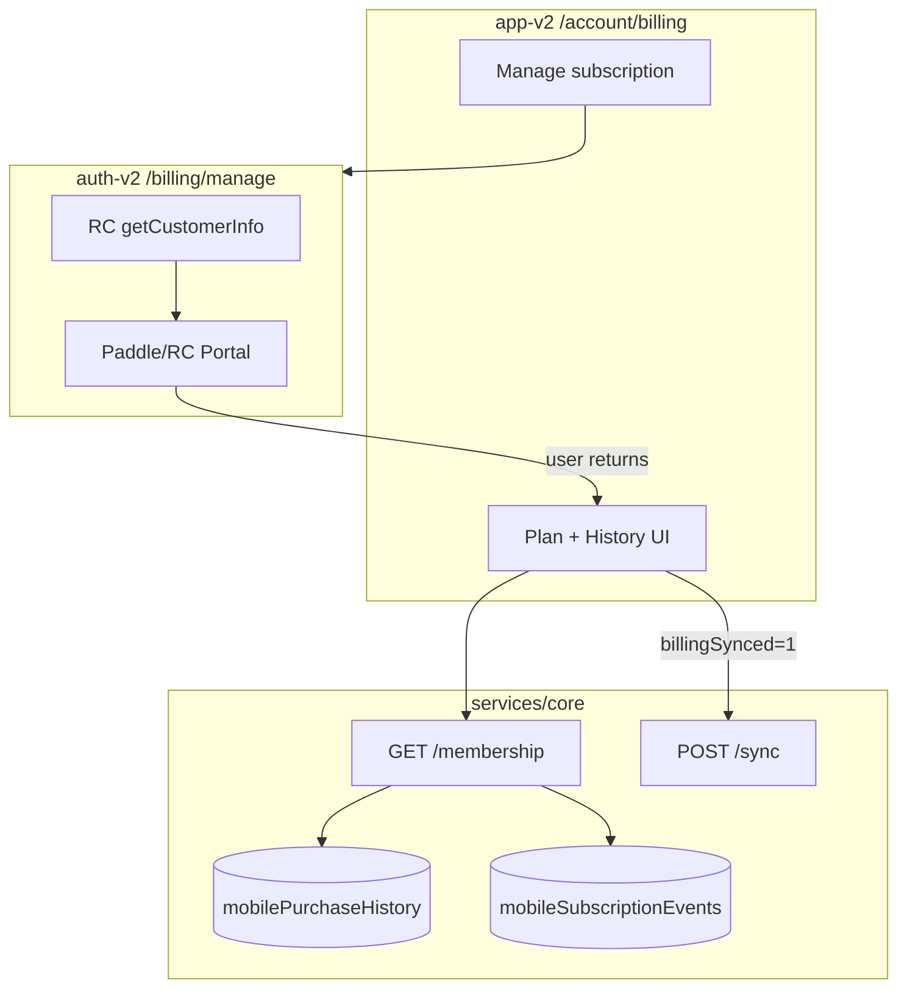

# Phase 4 — Billing & Subscription Management Report

**Date:** 2026-06-06  
**Related:** [PHASE4_BILLING_AUDIT.md](./PHASE4_BILLING_AUDIT.md)

---

## Summary

Phase 4 replaces billing stubs with provider-managed subscription management and real billing history from backend data. No UI redesign — same Billing page layout, enhanced content.

---

## What Existed Before

- Plan display (Free/Pro only)
- Upgrade flow (Phase 3)
- Stub "Manage plan" toast
- Fake invoice table with `$0` and download toast
- Webhook events only in membership API
- `mobilePurchaseHistory` written but never read

---

## What Was Implemented

### Backend (`services/core`)

| Change | Detail |
|--------|--------|
| `listPurchaseHistoryForUser()` | Read `mobilePurchaseHistory` |
| `GET /membership` | Now includes `purchases[]` |
| `GET /purchases` | Dedicated purchase history endpoint |

### Auth-v2 (portal host)

| Change | Detail |
|--------|--------|
| `/billing/manage` route | Opens RC `managementURL` in new tab |
| `billingClient.getManagementUrl()` | SDK `getCustomerInfo()` |
| `loadManageBillingSessionAction` | Auth + subscription history gate |
| `buildManageBillingUrl()` | Cross-app URL helper |

### App-v2 (display)

| Change | Detail |
|--------|--------|
| Billing page | Real plan labels, lifecycle status, feature list |
| Manage subscription button | Redirects to auth portal |
| Billing history table | Purchases + webhook events (no fake amounts) |
| Error state | Graceful loader failure with retry |
| Portal return sync | `?billingSynced=1` → `POST /sync` |
| Profile page | `formatPlanLabel`, smarter upgrade visibility |
| `subscription-display.ts` | Pure formatting / CTA logic |

---

## Architecture



---

## APIs Used

| Endpoint | Purpose |
|----------|---------|
| `GET /api/v1/subscriptions/membership` | Plan state + purchases + activity |
| `GET /api/v1/subscriptions/purchases` | Purchase history (available, membership preferred) |
| `POST /api/v1/subscriptions/sync` | Refresh after upgrade or portal |
| RC SDK `getCustomerInfo().managementURL` | Provider portal URL |

---

## Files Modified

### services/core
- `revenuecat/subscriptionRepository.ts`
- `services/subscription.service.ts`
- `controllers/subscription.controller.ts`
- `routes/subscription.routes.ts`

### novasafe-auth-v2
- `src/routes/billing.manage.tsx` (new)
- `src/lib/billing/client.ts`
- `src/lib/auth/auth-guard.ts`
- `src/lib/auth/server-actions.ts`
- `src/lib/api/endpoints/subscriptions.ts`
- `src/config/auth.config.ts`
- `src/config/routes.config.ts`
- `src/config/index.ts`

### novasafe-app-v2
- `src/routes/_app.account.billing.tsx`
- `src/routes/_app.account.profile.tsx`
- `src/lib/account/server-actions.ts`
- `src/lib/api/endpoints/subscriptions.ts`
- `src/lib/billing/subscription-display.ts` (new)
- `src/config/auth.config.ts`
- `src/config/routes.config.ts`
- `src/config/index.ts`

---

## Test Scenarios

| Scenario | Expected | Implementation |
|----------|----------|----------------|
| A: Free user | Upgrade CTA + free features | `shouldShowUpgrade()` |
| B: Active Pro | Pro Monthly/Annual + renewal + manage | `formatPlanLabel`, manage URL |
| C: Cancelled Pro | Cancelled + access until date + manage | `buildPlanSubtitle`, portal |
| D: Expired | Free state + upgrade/resubscribe | `shouldShowUpgrade`, resubscribe if purchases |
| E: Portal failure | Error message + return link | manage route error states |
| F: API failure | Billing page error banner + retry | `loadMembershipAction` ok:false |
| G: Portal return | Sync without logout | `?billingSynced=1` |

### Build verification

```
services/core     npm run build  ✅
services/core     npm run test   ✅ 16/16
novasafe-auth-v2  npm run build  ✅
novasafe-app-v2   npm run build  ✅
```

---

## Known Limitations

1. **No invoice PDFs in-app** — Paddle emails receipts; amounts not stored in MongoDB.
2. **Portal email verification** — RC management URL may require email confirmation (provider security).
3. **No polling** — State refreshes on navigation, `?upgraded=1`, `?billingSynced=1`, or manual revisit after 60s staleTime.
4. **Amount column removed** — Honest display without fabricated dollar values.
5. **Extension billing** — Out of Phase 4 scope.

---

## Remaining for Phase 5

- Extension subscription awareness
- Device limit upgrade CTAs for logged-in users
- In-app 403 → upgrade deep links in vault UI
- Optional: store transaction amounts when RC webhook provides them
- Optional: RC API v2 authorized portal URL (skip email step)
- Team / family / enterprise plans
