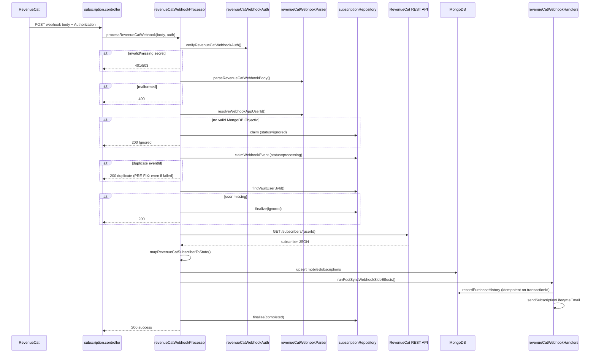

# Webhook Flow Audit — RevenueCat + Paddle (via RC)

**Audit date:** 2026-06-06  
**Scope:** `services/core/src/modules/subscriptions/`  
**Method:** Read-only trace before Phase 2 hardening

---

## Architecture Overview

Paddle does **not** webhook NovaSafe directly. Web purchases flow:

```
Paddle Checkout (via RC Web SDK)
  → RevenueCat records transaction
    → RevenueCat POST webhook
      → NovaSafe Core (/mobile/subscriptions/webhook/revenuecat)
        → GET RevenueCat REST /subscribers/{userId}
          → mobileSubscriptions (MongoDB cache)
            → API clients read entitlements
```

---

## Webhook Endpoint

| Property | Value |
|----------|-------|
| Path | `POST /api/v1/subscriptions/webhook/revenuecat` |
| Mirror | `POST /mobile/subscriptions/webhook/revenuecat` |
| Auth | `Authorization` header vs `REVENUECAT_WEBHOOK_SECRET` (timing-safe compare) |
| Controller | `subscription.controller.ts` → `handleRevenueCatWebhook` |
| Processor | `revenueCatWebhookProcessor.ts` → `processRevenueCatWebhook` |

---

## Event Processing Flow



---

## Idempotency Mechanism (Pre-Phase 2)

| Layer | Mechanism |
|-------|-----------|
| Event claim | `insertOne` on `mobileSubscriptionEvents` with unique index on `eventId` |
| Duplicate detection | MongoDB `E11000` → return `"duplicate"` |
| Purchase history | Unique index on `transactionId` in `mobilePurchaseHistory` |
| Subscription state | `updateOne` upsert on `userId` — overwrite, not append |

### Critical gap (fixed in Phase 2)

When processing **failed** (HTTP 500), event status = `failed`. RevenueCat retries with same `eventId`. Retry hit `E11000` → treated as duplicate → **200 without reprocessing**. Event permanently stuck in `failed`.

---

## Event Storage

**Collection:** `mobileSubscriptionEvents`

| Field | Purpose |
|-------|---------|
| `eventId` | RevenueCat event UUID (unique) |
| `eventType` | INITIAL_PURCHASE, RENEWAL, etc. |
| `userId` | NovaSafe user ObjectId |
| `transactionId` | RC transaction (sparse index) |
| `status` | processing \| completed \| failed \| ignored |
| `errorMessage` | Failure reason |
| `payload` | Raw webhook body |
| `processedAt` | Last status update |

---

## Entitlement Refresh Flow

1. Webhook triggers `refreshSubscriptionStateFromRevenueCat(userId, { lastEventType })`
2. Fetches `GET /v1/subscribers/{userId}` from RevenueCat REST
3. `resolveProFromSubscriber()` — entitlements map + subscriptions fallback
4. `mapRevenueCatSubscriberToState()` — tier, isActive, lifecycle status, entitlements
5. `persistSubscriptionState()` — upsert `mobileSubscriptions`

**Manual recovery (already exists):**
- `POST /api/v1/subscriptions/sync` — force RC refresh
- `GET /api/v1/subscriptions/state?forceRefresh=true`
- `assertEntitlementWithRefresh()` — entitlement check with live RC fallback

---

## Supported Event Types & Side Effects

| Event | RC sync | Purchase history | Email |
|-------|---------|------------------|-------|
| INITIAL_PURCHASE | ✅ | ✅ | purchase_successful |
| RENEWAL | ✅ | ✅ | subscription_renewed |
| CANCELLATION | ✅ | — | subscription_cancelled |
| EXPIRATION | ✅ | — | subscription_expired |
| BILLING_ISSUE | ✅ | — | payment_failed |
| UNCANCELLATION | ✅ | ✅ | subscription_renewed |
| PRODUCT_CHANGE | ✅ | ✅ | subscription_renewed |
| SUBSCRIPTION_PAUSED | ✅ | — | subscription_cancelled |
| TRANSFER | ✅ | ✅ | restore_successful |
| NON_RENEWING_PURCHASE | ✅ | ✅ | — |
| SUBSCRIPTION_EXTENDED | ✅ | ✅ | — |
| TEMPORARY_ENTITLEMENT_GRANT | ✅ | — | — |
| INVOICE_ISSUANCE | ✅ | — | — |
| TEST | ✅ | — | — |

All events run full RC subscriber sync regardless of type.

---

## Customer Identity

- RC `app_user_id` = MongoDB `vaultUsers._id` string
- Webhook resolves: `app_user_id` → `aliases[]` → `original_app_user_id` (first valid ObjectId)

---

## Subscription State Scenarios

| Scenario | RC REST reflects | Mapped state |
|----------|------------------|--------------|
| A: Purchase Pro | Active entitlement, future expires_date | tier=pro, isActive=true |
| B: Renewal | Active entitlement, updated dates | tier=pro, lastRenewalAt updated |
| C: Cancel | unsubscribe_detected_at set, expires_date future | tier=pro, status=cancelled, isActive=true until expiry |
| D: Expire | expires_date in past | tier=free, isActive=false, status=expired |
| E: Refund | Entitlement revoked in RC (typically expired) | tier=free via live RC sync |

State is always derived from **live RC subscriber** on webhook, not from event payload alone.

---

## Files in Webhook Path

| File | Role |
|------|------|
| `routes/subscription.routes.ts` | Route registration |
| `controllers/subscription.controller.ts` | HTTP handler |
| `revenuecat/revenueCatWebhookProcessor.ts` | Orchestrator |
| `revenuecat/revenueCatWebhookAuth.ts` | Secret validation |
| `revenuecat/revenueCatWebhookParser.ts` | Body parse + user ID resolve |
| `revenuecat/revenueCatWebhookHandlers.ts` | Email + purchase history |
| `revenuecat/revenueCatSubscriberSync.ts` | RC REST sync + persist |
| `revenuecat/subscriptionRepository.ts` | Event claim/finalize, state persist |
| `revenuecat/subscriptionStateMapper.ts` | RC → SubscriptionState |
| `revenuecat/entitlementResolver.ts` | Pro entitlement resolution |
| `services/revenue-cat.service.ts` | RC REST client |
| `revenuecat/subscriptionLogger.ts` | Structured logging |

**Note:** Folders `billing/`, `webhooks/`, `revenuecat/` at module root do not exist — all code lives under `revenuecat/` subfolder of `subscriptions/`.
